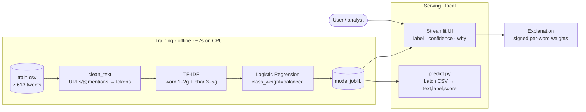

# Disaster Tweet Classifier

> Predict whether a short message describes a **real disaster** — served as a
> one-command local web app with a transparent, explainable model.


A deliberately **explainable linear model** (word + character TF-IDF →
logistic regression) trained on the public _NLP with Disaster Tweets_ dataset
(~7,600 hand-labelled tweets). The design choice is the point: for a
humanitarian triage aid, an analyst seeing _why_ a message was flagged matters
more than a fractional F1 gain from a black box — and the whole thing trains in
~7 seconds on CPU and runs offline on a fresh laptop.

## Architecture



Because the classifier is linear, each prediction is **fully attributable**:
a word's contribution is its TF-IDF weight × its learned coefficient. That is
exactly what the UI's _"Why this prediction?"_ panel and the model card surface.

## Quickstart (one command to run)

Requires **Python 3.10** (see `.python-version`).

```bash
git clone <your-repo-url>
cd disaster-tweet-classifier

python -m venv .venv
source .venv/bin/activate          # Windows: .venv\Scripts\activate
pip install -r requirements.txt

streamlit run app.py               # opens http://localhost:8501
```

A trained `model.joblib` is committed, so the UI runs immediately — no training
step at launch.

```bash
python train.py                                                   # retrain (~7s CPU)
python predict.py --input data/sample_tweets.csv --output out.csv # batch CLI
pytest                                                            # test suite
```

## Key design decisions

| Decision                                    | Why                                                                                                                                                     |
| ------------------------------------------- | ------------------------------------------------------------------------------------------------------------------------------------------------------- |
| **Linear model over transformer / LLM**     | Meets "trains <5 min on CPU" and "runs on a fresh machine offline"; an LLM needs runtime keys/network. The constraint _is_ the engineering.             |
| **Word + character n-grams**                | Character n-grams absorb the typos, hashtags, and spelling variants typical of tweets — robustness without a heavy NLP stack.                           |
| **Explainability as a first-class feature** | Linear coefficients make every call attributable; surfaced in the UI so a non-technical user can audit the model.                                       |
| **Brier score in evaluation**               | A calibration signal, not just accuracy — confidence is shown to users, so it has to mean something.                                                    |
| **Decision-support framing**                | False negatives (missing a real disaster) are the costliest error, so the UI exposes confidence + rationale and a model card rather than a bare yes/no. |

## Performance (20% stratified hold-out)

| Metric                    | Value |
| ------------------------- | ----- |
| Accuracy                  | 0.813 |
| F1 (disaster class)       | 0.779 |
| ROC-AUC                   | 0.870 |
| Brier score (calibration) | 0.138 |

Confusion matrix `[[TN 737, FP 132], [FN 153, TP 501]]`. Per the brief, the goal
is working code and sensible choices, not state-of-the-art F1.

## Project structure

```
disaster-tweet-classifier/
├── app.py                 # Streamlit UI: single + batch tabs, model card
├── predict.py             # batch CLI → text,label,score
├── train.py               # trains model.joblib + metrics.json
├── src/
│   ├── model.py           # word+char TF-IDF → logistic regression
│   └── text_clean.py      # conservative tweet normalisation
├── tests/                 # pytest: cleaning, model, CLI contract
├── data/                  # training data + sample CSV
├── model.joblib           # committed trained artifact
├── metrics.json           # hold-out validation metrics
├── requirements.txt       # pinned
└── .python-version        # 3.10.11
```

## Testing

```bash
pytest        # 7 tests over cleaning, model, and CLI contract
```

The full pipeline is verified in a clean virtual environment (fresh venv →
pinned install → `streamlit run` / `predict.py` / retrain) before release.

## Limitations & responsible use

- **Decision-support, not an authority** — a human should confirm before any
  operational action; the UI always exposes confidence and rationale.
- Trained on 2015-era English tweets; weaker on sarcasm, metaphor, non-English
  text, and event types unseen in training.
- No personal data is used at train time beyond the public tweet text.

## Data attribution

Dataset: _Natural Language Processing with Disaster Tweets_
(Kaggle `nlp-getting-started`), used for non-commercial evaluation.

## License

MIT — see [LICENSE](LICENSE).
